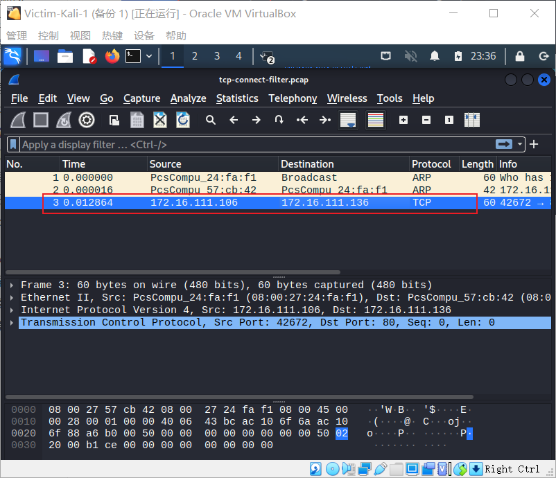
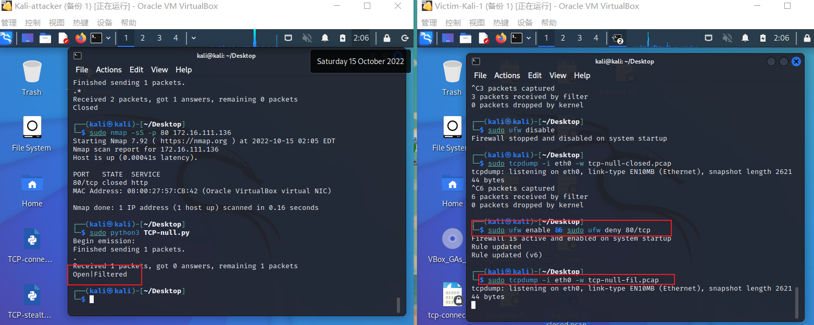
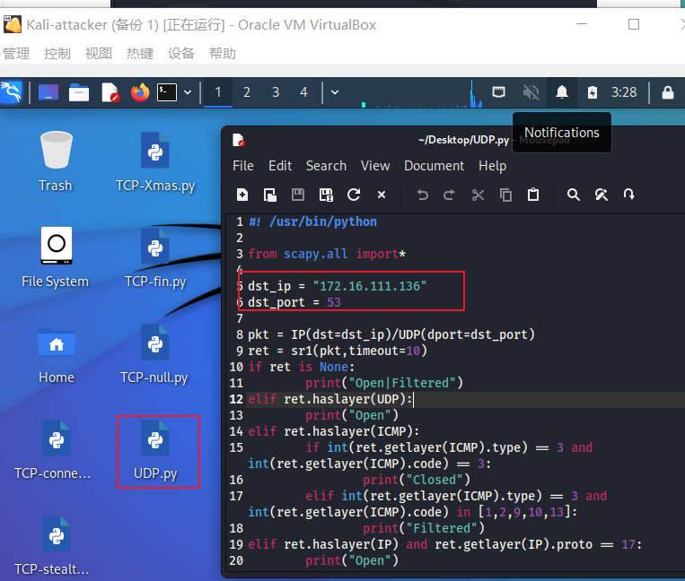
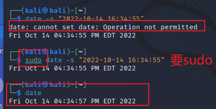

# 第五章：基于 Scapy 编写端口扫描器

## 实验目的

- 掌握网络扫描之端口状态探测的基本原理

## 实验环境

- python + scapy
- VirtualBox 虚拟机
- 攻击者主机（Attacker）：Kali Rolling 2022.3
- 网关（Gateway, GW）：Debian 10
- 靶机（Victim）：kali 2022.3

## 实验要求

- 禁止探测互联网上的 IP ，严格遵守网络安全相关法律法规

- [x] TCP connect scan / TCP stealth scan
- [x]  TCP Xmas scan / TCP fin scan / TCP null scan
- [x]  UDP scan
- [x]  上述每种扫描技术的实现测试均需要测试端口状态为：`开放`、`关闭` 和 `过滤` 状态时的程序执行结果
- [x] 提供每一次扫描测试的抓包结果并分析与课本中的扫描方法原理是否相符？如果不同，试分析原因；
- [x]  在实验报告中详细说明实验网络环境拓扑、被测试 IP 的端口状态是如何模拟的
- [x]  （可选）复刻 `nmap` 的上述扫描技术实现的命令行参数开关（每种扫描测试一种状态，且后面专门用nmap进行了扫描实验）

## 实验原理

#### 课本原理

> `TCP connect scan` 与 `TCP stealth scan` 都是先发送一个`S`，然后等待回应。如果有回应且标识为`RA`，说明目标端口处于关闭状态；如果有回应且标识为`SA`，说明目标端口处于开放状态。这时
>
> - `TCP connect scan`会回复一个RA，在完成三次握手的同时断开连接
> - `TCP stealth scan`只回复一个R，不完成三次握手，直接取消建立连接
>
> `TCP Xmas scan、TCP fin scan`及`TCP null scan`不涉及三次交互。它们都是先发送一个包，然后根据目标主机是否回复`R`来目标端口的状态。不同的是：
>
> - TCP Xmas scan发送的是`FPU`
> - TCP fin scan发送的是`F`
> - TCP null scan发送的包里没有设置任何flag
>
> UDP是无连接的协议，通过发送`UDP+port`得到的回复确定被扫描主机的状态。
>
> - Open：`no response / server responds to the client with a UDP packet`；
> - Closed：`ICMP error type 3 and code 3`
> - filtered：`no response / ICMP error type 3 and code 1,2,3,9,10,13`。

#### Kali端口命令

```bash
## 使用防火墙
#允许端口访问
sudo ufw enable && ufw allow portno/tcp(udp)
#停用端口访问
sudo ufw disable
#端口过滤
sudo ufw enable && sudo ufw deny 80/tcp(udp)
## 使用iptables
# 允许端口访问
sudo iptables -A INPUT -p tcp --dport 80 -j ACCEPT
# 端口过滤
sudo iptables -A INPUT -p tcp --dport 80 -j DROP
#指定端口监听
nc -l -p 80
lsof -i 4 -L -P -n//查看处于监听状态的端口
```

#### 端口状态模拟

> - 查看当前防火墙的状态和现有规则
>
> 	```bash
>	sudo ufw status
> 	```
>
> - 关闭状态：对应端口没有开启监听, 防火墙没有开启。
>
>   ```bash
>   sudo ufw disable
>   ```
>
> - 开启状态：对应端口开启监听: apache2基于TCP, 在80端口提供服务; DNS服务基于UDP,在53端口提供服务。防火墙处于关闭状态。
>
>   ```bash
>   systemctl start apache2 # port 80
>   systemctl start dnsmasq # port 53
>   ```
>
> - 过滤状态：对应端口开启监听, 防火墙开启。
>
>   ```bash
>   ufw enable && ufw deny 80/tcp
>   ufw enable && ufw deny 53/udp
>   ```

## 实验过程

### 网络拓扑图


| GateWay      | Kali-Attacker  | Kali-Victim    |
| ------------ | -------------- | -------------- |
| 172.16.111.1 | 172.16.111.106 | 172.16.111.136 |

### TCP connect scan

- 攻击者向靶机发送SYN包，如果能完成三次握手（收到ACK），则端口为开放状态；
- 如果只收到一个RST包，则端口为关闭状态；
- 如果什么都没有收到，则端口为过滤状态。

#### 实验代码

```python
#! /usr/bin/python

from scapy.all import *

src_port = RandShort()
dst_ip = "172.16.111.136"
dst_port = 80

ret = sr1(IP(dst=dst_ip)/TCP(sport=src_port,dport=dst_port,flags=0x2),timeout=10)
if ret is None:
    print("Filtered")
elif ret.haslayer(TCP):
    if ret[1].flags == 0x12:
        print("Open")
    elif ret[1].flags == 0x14:
        print("Closed")
```

- 在攻击机中写入并运行代码：

####  Closed

  

- 在靶机上进行抓包，`sudo tcpdump -i eth0 -w tcp-connect-close.pcap`：

- 打开wireshark分析抓到的数据包，接收到RST/ACK数据包，说明80端口处于关闭状态：

`如果服务器返回了一个带有 RST 标识的 TCP 数据包，那么说明端口处于关闭状态。`

- 用nmap复刻结果，`nmap -sT -p 80 -n -vv 172.16.111.136`：

#### Filtered

- 靶机端口过滤：

  - ```bash
    # 端口过滤
    sudo iptables -A INPUT -p tcp --dport 80 -j DROP
    ```

  

- Kali-Attacker运行代码发送包，靶机抓包：靶机抓包：

- 只接收到一个TCP包，说明端口处于过滤状态：

- 用nmap复刻结果：

#### Open

- 靶机删除先前过滤条件，同时开启监听：

  ```bash
  #首先下载ufw
  sudo apt install ufw
  #允许端口访问
  sudo ufw enable && ufw allow 80/tcp
  #指定端口监听
  nc -l -p 80
  ```

  

- Attacker发送包

- 抓包结果中有三个TCP包，是一个完整的握手过程，说明端口开启

- nmap复刻结果`namp -PN -sT 80 172.16.111.136`

### TCP stealth scan

- 与connect scan相似，Attacker向靶机发送SYN包，如果端口开启，就会收到SYN/ACK响应包，但此时Attacker会向靶机发送RST数据包，来避免完成TCP三次握手，从而避免防火墙的探测；
- 如果端口关闭，Attacker会收到RST数据包；
- 如果端口处于过滤状态，则没有数据包返回，或者收到数据包的ICMP错误包，并显示不可达错误`type = 3 code 1,2,3,9,10,13`。

#### 实验代码

```python
#! /usr/bin/python

from scapy.all import *


def tcpstealthscan(dst_ip, dst_port, timeout=10):
    pkts = sr1(IP(dst=dst_ip)/TCP(dport=dst_port, flags="S"), timeout=10)
    if (pkts is None):
        print("Filtered")
    elif(pkts.haslayer(TCP)):
        if(pkts.getlayer(TCP).flags == 0x12):
            send_rst = sr(IP(dst=dst_ip) /
                          TCP(dport=dst_port, flags="R"), timeout=10)
            print("Open")
        elif (pkts.getlayer(TCP).flags == 0x14):
            print("Closed")
        elif(pkts.haslayer(ICMP)):
            if(int(pkts.getlayer(ICMP).type) == 3 and int(stealth_scan_resp.getlayer(ICMP).code) in [1, 2, 3, 9, 10, 13]):
                print("Filtered")


tcpstealthscan('172.16.111.136', 80)
```

​	

#### Closed

```bash
#停用端口访问
sudo ufw disable
```

- 
- Attacker发送包：

- 查看数据包，发现靶机发送的数据报为RST/ACK数据包，说明端口关闭

- nmap复刻结果`nmap -sT -p 80 -n -vv 172.16.111.136`:

#### Filtered

```bash
#端口过滤
sudo ufw enable && sudo ufw deny 80/tcp(udp)
```

- 
- 查看数据包，发现靶机只收到了一个TCP包，没有遇到发送错误ICMP包的情况，仍然可以说明端口是关闭的
- nmap复刻结果`sudo nmap -sS -p 80 172.16.111.136`:

#### Open

```bash
#允许端口访问
sudo ufw enable && ufw allow 80/tcp
#指定端口监听
nc -l -p 80
```

- 

- 查看数据包，发现靶机发送了SYN/ACK数据包，说明端口开启；靶机收到了Attacker发送的RST数据包，说明进行了SYN扫描

- nmap复刻结果`sudo nmap -sS -p 80 172.16.111.136`:

### TCP Xmas scan

- 在Xmas扫描中，Attacker发送的TCP数据包中设置PSH、FIN和URG位

  | Probe Response                                         | Assigned State |
  | ------------------------------------------------------ | -------------- |
  | No response received(even after retransmissions)       | open/          |
  | TCP RST packet                                         | closed         |
  | ICMP unreachable error(type 3, code 1,2,3,9,10, or 13) | filtered       |

#### 实验代码

```python
#! /usr/bin/python

from scapy.all import *

dst_ip = "172.16.111.136"
dst_port=80

ret = sr1(IP(dst=dst_ip)/TCP(dport=dst_port,flags="FPU"),timeout=10)
if ret is None:
	print("Open|Filtered")
elif ret.haslayer(TCP):
	if ret[1].flags == 0x14:
		print("Closed")
elif ret.haslayer(ICMP):
	if int(ret[1].getlayer(ICMP).type)==3 and int(ret[1].getlayer(ICMP).code) in [1,2,3,9,10,13]:
		print("Filtered")
```


#### Closed

- 
- 查看数据包，发现Attacker发送了RST/ACK数据包，说明端口关闭
- nmap复刻结果`sudo nmap -sS -p 80 172.16.111.136`:

#### Filtered

- 
- 查看数据包，发现靶机只收到一个TCP包，没有响应，说明端口处于过滤或开启状态
- nmap复刻结果`sudo nmap -sS -p 80 172.16.111.136`:

#### Open

- 靶机开启端口，攻击机发送包，靶机记录，并用nmap复刻结果`sudo nmap -sS -p 80 172.16.111.136`:
- 靶机只收到一个TCP包，没有响应，说明端口处于过滤或开启状态

### TCP fin scan

- 在Attacker发送TCP数据包时仅设置TCP FIN位；
- 端口判断与Xmas scan一致

#### 实验代码

```python
#! /usr/bin/python

from scapy.all import *

dst_ip = "172.16.111.136"
dst_port=80

ret = sr1(IP(dst=dst_ip)/TCP(dport=dst_port,flags="F"),timeout=10)
if ret is None:
	print("Open|Filtered")
elif ret.haslayer(TCP):
	if ret[1].flags == 0x14:
		print("Closed")
elif ret.haslayer(ICMP):
	if int(ret[1].getlayer(ICMP).type)==3 and int(ret[1].getlayer(ICMP).code) in [1,2,3,9,10,13]:
		print("Filtered")
```


#### Closed

- 

- Attacker发送了RST/ACK数据包，说明端口关闭：
- 用nmap复刻结果`sudo nmap -sS -p 80 172.16.111.136`:

#### Filtered

- 

- 靶机只收到一个TCP包，并且没有响应，说明端口处于过滤或开启状态
- 用nmap复刻结果`sudo nmap -sS -p 80 172.16.111.136`:

#### Open

- 
- 靶机只收到一个TCP包，没有响应，说明端口处于过滤或开启状态

- 用nmap复刻结果`sudo nmap -sS -p 80 172.16.111.136`:

### TCP null scan

- 在Attacker发送TCP数据包时不设置任何位；
- 端口判断与Xmas scan一致

#### 实验代码

```python
#! /usr/bin/python

from scapy.all import *

dst_ip = "172.16.111.136"
dst_port=80

ret = sr1(IP(dst=dst_ip)/TCP(dport=dst_port,flags=""),timeout=10)
if ret is None:
	print("Open|Filtered")
elif ret.haslayer(TCP):
	if ret[1].flags == 0x14:
		print("Closed")
elif ret.haslayer(ICMP):
	if int(ret[1].getlayer(ICMP).type)==3 and int(ret[1].getlayer(ICMP).code) in [1,2,3,9,10,13]:
		print("Filtered")
```


#### Closed

- 
- Attacker发送了RST/ACK包，说明端口关闭
- 用nmap复刻结果`sudo nmap -sS -p 80 172.16.111.136`:

#### Filtered

- 
- 靶机只收到一个TCP包且没有响应，说明端口处于过滤或开启状态
- 用nmap复刻结果`sudo nmap -sS -p 80 172.16.111.136`:

#### Open

- 
- 靶机只收到一个TCP包且没有响应，说明端口处于过滤或开启状态
- 用nmap复刻结果`sudo nmap -sS -p 80 172.16.111.136`:

### UDP scan

- UDP是一种无连接的传输协议，不保证数据包一定到达目的地；
- Attacker收到来自靶机的UDP响应包时，说明端口开启；
- 同时若没有得到响应，端口也可能处于开启或过滤状态；
- 如果收到ICMP端口不可达错误，说明端口关闭；
- 如果收到其他ICMP错误，说明端口处于过滤状态

#### 实验代码

```python
#! /usr/bin/python

from scapy.all import *

dst_ip="172.16.111.136"
dst_port=53

pkt = IP(dst=dst_ip)/UDP(dport=dst_port)
ret = sr1(pkt,timeout=10)
if ret is None:
	print("Open|Filtered")
elif ret.haslayer(UDP):
	print("Open")
elif ret.haslayer(ICMP):
	if int(ret.getlayer(ICMP).type)==3 and int(ret.getlayer(ICMP).code)==3:
		print("Close")
	elif int(ret.getlayer(ICMP).type)==3 and int(ret.getlayer(ICMP).code) in [1,2,9,10,13]:
		print("Filtered")
elif ret.haslayer(IP) and ret.getlayer(IP).proto == 17:
        print("Open")
```



#### Closed

- 

- 靶机收到Attacker发送的UDP数据包，并发送了ICMP端口不可达的数据包，在ICMP数据中Type和code都为3，说明端口关闭

  

- 用nmap复刻结果`sudo nmap -sU -p 53 172.16.111.136`:

#### Filtered

- 
- 靶机接收到Attacker发送的UDP数据包，但没有做出响应，说明端口处于过滤状态
- 用nmap复刻结果`sudo nmap -sS -p 53 172.16.111.136`:

#### Open

- 安装dnsmasq工具`sudo apt install dnsmasq`并开启`sudo systemctl start dnsmasq`
- 开启端口`sudo ufw enable && ufw allow 53/udp``nc -l -u -p 53`

- 靶机接受了Attacker发送的UDP数据包并发送了响应包，说明端口开启

- 用nmap复刻结果`sudo nmap -sS -p 8888 172.16.111.136`:

## 问题与解决办法

- 我的`apt-get update`用不了了，显示：
  - 解决方法：[(42条消息) ubuntu在更新软件时出现E: Release file for http://security.ubuntu.com/ubuntu/dists/bionic-security/InRelease_师玉幺叔的博客-CSDN博客](https://blog.csdn.net/weixin_45663954/article/details/123394680?spm=1001.2101.3001.6661.1&utm_medium=distribute.pc_relevant_t0.none-task-blog-2~default~CTRLIST~Rate-1-123394680-blog-102715612.pc_relevant_3mothn_strategy_recovery&depth_1-utm_source=distribute.pc_relevant_t0.none-task-blog-2~default~CTRLIST~Rate-1-123394680-blog-102715612.pc_relevant_3mothn_strategy_recovery&utm_relevant_index=1)
  - `date -s "2022-10-14 16:36:55"`:

## 实验总结

1.扫描方式与端口状态的对应关系：

| 扫描方式/端口状态             | 开放                            | 关闭            | 过滤            |
| ----------------------------- | ------------------------------- | --------------- | --------------- |
| TCP connect / TCP stealth     | 完整的三次握手，能抓到ACK&RST包 | 只收到一个RST包 | 收不到任何TCP包 |
| TCP Xmas / TCP FIN / TCP NULL | 收不到TCP回复包                 | 收到一个RST包   | 收不到TCP回复包 |
| UDP                           | 收到UDP回复包                   | 收不到UDP回复包 | 收不到UDP回复包 |

2.提供每一次扫描测试的抓包结果并分析与课本中的扫描方法原理是否相符？如果不同，试分析原因。

- 相符

## 参考链接

- [Linux kali开启端口、关闭防火墙](https://blog.csdn.net/qq_42103479/article/details/90111365)
- [ c4pr1c3/cuc-ns-ppt ](https://github.com/c4pr1c3/cuc-ns-ppt/blob/master/chap0x05.md)
- [师姐作业](https://github.com/CUCCS/2021-ns-public-Lychee00/blob/bcbf7c8051047e3d0a8d61612f643a26b8274df0/chap0x05/report05.md)

## 课后思考题

- 通过本章网络扫描基本原理的学习，试推测应用程序版本信息的扫描原理，和网络漏洞的扫描原理。

  - 应用程序版本信息扫描原理：通过扫描靶机的所有应用程序，根据是否收到响应推断应用程序是否为活跃状态
  - 网络漏洞扫描原理： 漏洞扫描可以划分为ping扫描、端口扫描、OS探测、脆弱点探测、防火墙扫描五种主要技术，每种技术实现的目标和运用的原理各不相同。按照 TCP/IP协议簇的结构，ping扫描工作在互联网络层：端口扫描、防火墙探测工作在传输层;0S探测、脆弱点探测工作在互联网络层、传输层、应用层。 ping扫描确定目标主机的IP地址，端口扫描探测目标主机所开放的端口，然后基于端口扫描的结果，进行OS探测和脆弱点扫描 。

- 网络扫描知识库的构建方法有哪些？

  - 端口扫描： 端口扫描向目标主机的tcp/ip服务端口发送探测数据包，并记录目标主机的响应，还是关闭，就可以得知端口状态。帮助我们发现目标通过分析响应。还是关闭，就可以得知端口状态。帮助我们发现目标通过分析响应来判断服务器端口是打开主机的某些内在的弱点。

  - 漏洞扫描：根据网络扫描得到的信息/报文，进行分析靶机存在的潜在漏洞

    