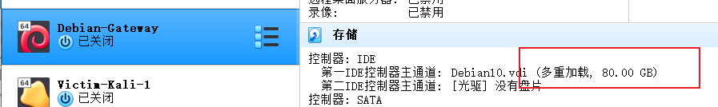
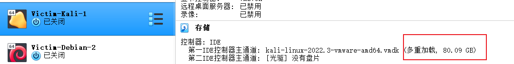
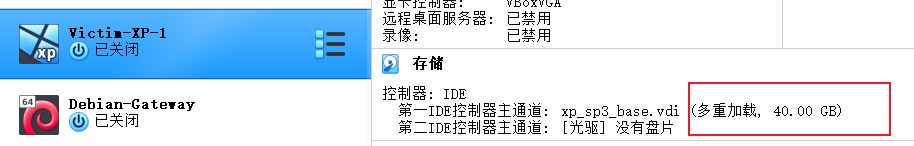

# 基于 VirtualBox 的网络攻防基础环境搭建

## 实验目的

* 掌握 VirtualBox 虚拟机的安装与使用；
* 掌握 VirtualBox 的虚拟网络类型和按需配置；
* 掌握 VirtualBox 的虚拟硬盘多重加载；

## 实验环境

* VirtualBox 虚拟机
* 攻击者主机（Attacker）：Kali Rolling 2022.3
* 网关（Gateway, GW）：Debian 10
* 靶机（Victim）：
  * kali 2022.3
  * Debian 10
  * Windows XP Professional with Service Pack 3 (x86)


  ## 实验要求

  * 虚拟硬盘配置成多重加载，效果如下图所示；

  

  * 搭建满足如下拓扑图所示的虚拟机网络拓扑；

  

  > 根据实验宿主机的性能条件，可以适度精简靶机数量

  * 完成以下网络连通性测试；
    - [x] 靶机可以直接访问攻击者主机
    - [x] 攻击者主机无法直接访问靶机
    - [x] 网关可以直接访问攻击者主机和靶机
    - [x] 靶机的所有对外上下行流量必须经过网关
    - [x] 所有节点均可以访问互联网

  ## 实验过程

  ### 安装虚拟机

  - 在kali官方下载并安装 [最新版 `Kali` 的虚拟机镜像版](https://www.kali.org/get-kali/#kali-virtual-machines)，导入虚拟机中。
  - 下载并导入老师给的 `Debian 10` 和 `Windows XP SP3` 的虚拟硬盘文件。

  ### 多重加载

  **虚拟硬盘配置成多重加载：**

步骤：管理->虚拟介质管理->选择对应的虚拟硬盘进行释放->属性选择多重加载并应用（如下图）


  debian：

kali：

xp：


### 根据拓扑结构配置网络

按照上述拓扑图,需要**6台**虚拟机，如下图：


1.配置Debian-Gateway，四张网卡的状态分别为：

- NAT网络，使网关可访问攻击者主机
- 仅主机（`Host-Only`）网络，进行网卡设置
- 内部网络`intnet1`，搭建局域网1
- 内部网络`intnet2`，搭建局域网2

配置如下图：


2.配置攻击者`attacker`的网络状态为：

- `NAT`网络
- 两块不同的`Host-Only`网卡


3.其他4台`victim`靶机分别在两个局域网内，仅需配置内部网络的一张网卡即可，故设置为内部网络：

- `victim-kali-1`和`victim-xp-1`在局域网`intnet1`内
- `victim-debian-2`和`victim-xp-2`在局域网`intnet2`内


### 获取IP

获取IP地址时需要打开网关（Debian-Gateway）

网关开机后的ip：


对应系统的查看`IP`指令为

```
    Windows XP : ipconfig
    Debian: ip addr
    kali:  ip add
```

  


IP地址如下：

| 虚拟机          | IP地址         | 网络       |
| --------------- | -------------- | ---------- |
| Kali-attacker   | 10.0.2.4       |            |
| Victim-Kali-1   | 172.16.111.136 | Internet 1 |
| Victim-XP-1     | 172.16.111.108 | Internet 1 |
| Victim-XP-2     | 172.16.222.101 | Internet 2 |
| Victim-Debian-2 | 172.16.222.135 | Internet 2 |

### 连通性测试

#### 靶机可以直接访问攻击者主机

- **Victim-XP-1** ping通攻击者主机：


- **Victim-Kali-1** ping通攻击者主机：


- **Victim-Debian-2** ping通攻击者主机：


- **Victim-XP-2** ping通攻击者主机：


#### 攻击者主机无法直接访问靶机

**攻击者主机ping Intnet 1 和Internet 2 上的靶机：**


#### 网关可以直接访问攻击者主机和靶机

- 网关ping通攻击者主机：


- 网关ping通靶机：


#### 靶机的所有对外上下行流量必须经过网关

- 在网关对应的主机上安装`tcpdump`和`tmux`

```
apt install tcpdump
apt update && apt install tmux
```

抓包指令为 `sudo tcpdump -c 5`

- **Intnet 1测试：**


internet1中的靶机`ping www.baidu.com`后，在网关中会受到流量消息。

- **Intnet 2测试：**


- 使用指令`tcpdump -i enp0s9 -n -w net1.pcap`将抓取到的包放到`pcap`文件中，在本地用`wireshark`进行分析

Internet 1：


Internet 2：


- `ls`发现已保存两个流量包：


- 使用`scp`和vscode将流量包发至本机：


- 获得流量包：


- 用`wireshark`打开并分析：


发现有`Victim-XP-1`的ip地址发出的流量信息，均符合靶机和目标网址等信息，证明靶机的所有上下行流量必须经过网关。

#### 所有节点均可以访问互联网

- 局域网1内的靶机可以ping通`www.baidu.com`：


- 局域网2内的靶机可以ping通`www.baidu.com`：


- 攻击者主机可以ping通`www.baidu.com`：


## 问题及反思

发现我vscode连接不到网关机，然后我用了另一台可连接的机子连接vscode，再通过从网关机发送流量包到机子中，从而发到主机，有没有更好的办法捏？总是显示连接失败，不知道是啥问题？...


## 参考链接

- [2121030134-网络安全01\] - 中国传媒大学 (cuc.edu.cn)](http://courses.cuc.edu.cn/course/90732/learning-activity/full-screen#/378195)
- [哥/姐的作业](https://github.com/CUCCS/2021-ns-public-Zhang1933/blob/8d4f624a177d5966dde33d760d97338612c60379/ch0x01/0x01.md)

  ## 课后思考

  **以下行为分别破坏了CIA和AAA中哪⼀个属性或多个属性？**

**CIA：**保密性（Confidentiality）、完整性（Integrity）和可用性（Availability）

**AAA：**认证、授权、计费

  - 小明抄小强的作业
    -  CIA:保密性 
    - AAA:认证,授权
  - 小明把小强的系统折腾死机了
    -  CIA:可用性 
    - AAA:授权
  - 小明修改了小强的淘宝订单 
    - CIA:完整性,保密性
    - AAA:认证,授权
  - 小明冒充小强的信用卡账单签名 
    - CIA:完整性,可用性(这个不确定)
    -  AAA:认证,授权
  - 小明把自⼰电脑的IP修改为小强电脑的IP，导致小强的电脑⽆法上⽹
    -  CIA:可用性
    -  AAA:认证,授权
