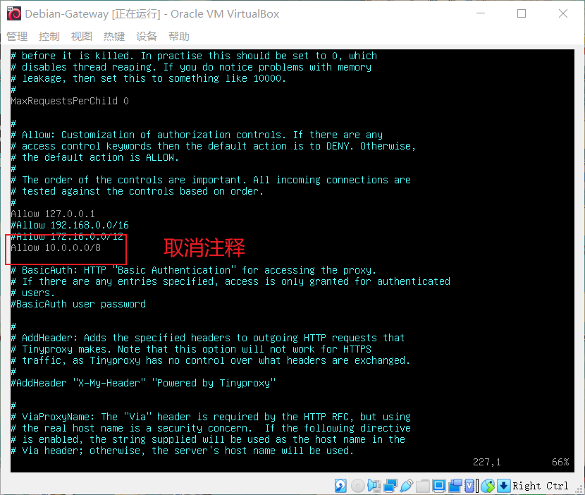

# 第三章实验：HTTP代理服务器实验

## 实验环境

- VirtualBox 虚拟机
- 攻击者主机（Attacker）：Kali Rolling 2022.3
- 网关（Gateway, GW）：Debian 10
- 靶机（Victim）：kali 2022.3
- ubuntu 20.04
- chrome Version 93.0.4577.63

## 实验目的

- 在网关Gateway中安装**tinyproxy**
- 用主机设置浏览器代理指向tinyproxy建立的HTTP正向代理
- 在Kali中用wireshark抓包，分析抓包过程，理解HTTP正向代理HTTPS流量的特点。

## 实验步骤

- 本次实验需要的主机及其网络拓扑图：


### 1.在网关Gateway中安装tinyproxy。

```
sudo apt-get update & apt-get install tinyproxy
```

### 2.编辑tinyproxy配置文件，取消<u>Allow 10.0.0.0/8</u>注释

```
# 备份tinyproxy配置文件
cp /etc/tinyproxy/tinyproxy.conf /etc/tinyproxy/tinyproxy.conf.bak

# 编辑tinyproxy配置文件
sudo vim /etc/tinyproxy/tinyproxy.conf

# 取消<u>Allow 10.0.0.0/8</u>注释
```



- 允许10.0.0.0/8使用网关作为代理服务器

### 3.开启tinyproxy服务

```
# 开启tinyproxy服务
systemctl start tinyproxy
```

- 测试curl通过代理访问百度：


- 可以访问到，说明代理服务已开启。

### 4.在攻击者主机的浏览器中配置代理服务

- 打开firefox，点击`Settings`->`Configure Proxy Access to the Internet`进入代理设置，填写网关IP及端口号，如下图：


### 5.使用tinyproxy访问网站

- 访问网站并使用<u>wireshark</u>进行抓包
- 查看流量包
- 发现使用了tinyproxy


- wireshark分析抓到的数据包可知，传输的数据被加密了。


### 6.攻击者主机访问靶机IP网站

- 靶机开启apache

  - ```
    打开：/etc/init.d/apache2 start
    ```

- 攻击者使用浏览器访问并开启wireshark抓包：


- 查看获取的流量包
- 可以发现HTTP响应里含有`Via: 1.1 tinyproxy (tinyproxy/1.10.0)`字段
- 使用了tinyproxy代理


### 7.在靶机的浏览器中配置代理服务

- 同上方法设置代理服务
- 开启wireshark抓包并访问网站


- 查看抓到的包
- 发现也使用了代理


- （查看不同的数据包，发现都有代理的痕迹）


### Q：使用http代理服务器访问HTTPS站点时，通信传输内容是否会被代理服务器“看到”？

- 在攻击者主机上用firefox访问网站，同时在网关上进行抓包

- 代理服务器（即网关）可以直接看到用户访问的网址，HTTP请求和响应的信息都是以明文形式展现


- 使用https，代理服务器（网关）处能看到用户访问的网址，但是传输的数据被加密了。

## 问题与解决方法

- 在攻击者主机访问靶机站点http://172.16.111.136时，显示如下图：


- 查看数据包：


- 发现网关对攻击者主机的回应是使用了tinyproxy的

- 参考了网上的：

  - [tinyproxy 反向代理无法上网原因 - ywliao - 博客园 (cnblogs.com)](https://www.cnblogs.com/ywliao/p/10885461.html)
  - [http - 微小的代理无法转发连接方法 - 堆栈溢出 (stackoverflow.com)](https://stackoverflow.com/questions/36214703/tinyproxy-unable-to-forward-connect-methods)
  - 还是没有什么进展

- 然后 我找到了 原因。。。

  - 因为 我没有 开启 apache！！

  - ```
    打开：/etc/init.d/apache2 start
    
    重启：/etc/init.d/apache2 restart
    
    关闭：/etc/init.d/apache2 stop
    ```

  - 

  - 攻击者主机访问靶机的IP网址成功了）

## 实验小结

- 通过代理服务器可以绕过某些访问限制；
- 代理服务器可以看到用户访问的网址；
- 代理服务器无法看到https通信数据。

## 课后习题

#### 1.代理技术在网络攻防中的意义？

第一，使用代理服务器是匿名的，所以，无论是网站还是其他用户不知道您具体的代理服务器的真正ip，这对网站来说足够安全，不会轻易遭受攻击。

第二，使用代理服务器，也能被阻止资源的访问。在互联网上，有阻止用户完全访问您的网站或任何其职能资源，从而没有对用户所在的国家的锁。也就是说，如果举例说明，就是你住在俄罗斯，想要观看的欧洲网站上的影片，但它不适用于我国的用户来说，使用另一个国家的代理服务器(访问哪些是开放的)，你可以观看该视频。这是关于用户的国家的站点的有限功能的示例，但某些资源并执行阻止的网站网页，什么是代理也将是该问题的解决方案。

#### 2.常规代理技术和高级代理技术的设计思想区别与联系？

- 区别： 高级代理技术对通信的匿名性有较高要求，使⽹络安全对抗过程变得复杂。
- 联系： 高级代理技术对通信的匿名性有较高要求，有时可以通过常用代理技术实现高级代理，实现起来相对简单高效。

## 参考链接

- [(41条消息) kali带apache_kali Linux怎么安装apache_weixin_39586265的博客-CSDN博客](https://blog.csdn.net/weixin_39586265/article/details/112951260?spm=1001.2101.3001.6661.1&utm_medium=distribute.pc_relevant_t0.none-task-blog-2~default~CTRLIST~Rate-1-112951260-blog-121547739.pc_relevant_multi_platform_whitelistv3&depth_1-utm_source=distribute.pc_relevant_t0.none-task-blog-2~default~CTRLIST~Rate-1-112951260-blog-121547739.pc_relevant_multi_platform_whitelistv3&utm_relevant_index=1)

- [2021-ns-public-Lychee00/report03.md at 40adcbce34f05b4c9c2204e9ef38b286b4e01185 · CUCCS/2021-ns-public-Lychee00 (github.com)](https://github.com/CUCCS/2021-ns-public-Lychee00/blob/40adcbce34f05b4c9c2204e9ef38b286b4e01185/chap0x03/report03.md)